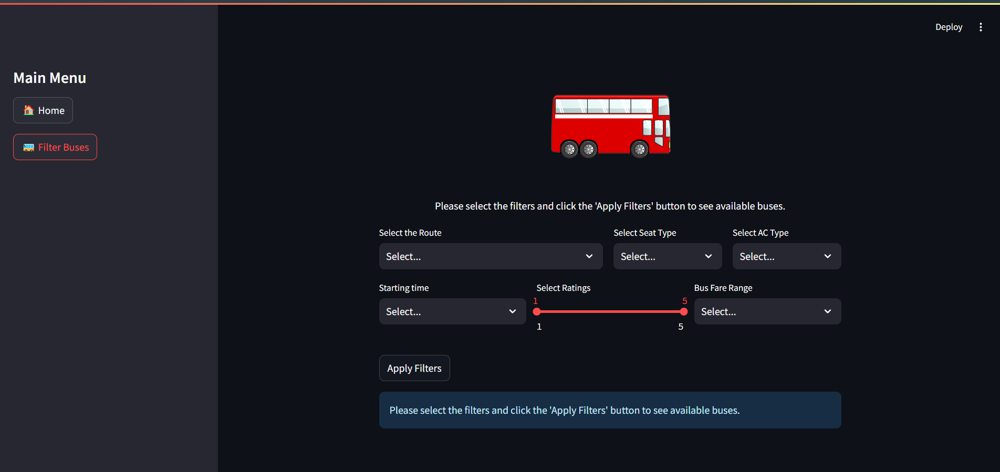
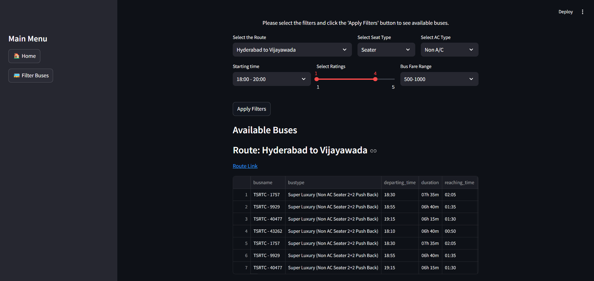

# RedBus Data Scrapping and Dynamic Filtering Application
This project is a Streamlit-based web application designed to help users filter and display bus services from the RedBus dataset. The project fetches data from a MySQL database and offers users a set of customizable filters to narrow down bus options based on their preferences.

## Features
### 1. Data Scraping Using Selenium
Data is scraped from the dynamic RedBus website using Selenium and stored in a MySQL database. 
The scraping script goes through 12 RTC's. It navigates through all pages under each RTC Card and goes through each route. Clicks on available View Buses Buttons, scrolls to the bottom of the page and collect bus routes, bus route links, bus types, timings, fare, and seat availability of all buses available. It ensures that proper time is provied to load all data.

### 2. MySQ Database Interaction
The project connects to MySQL database to fetch and manage bus route data.
It uses Pandas to manipulate the fetched data, including categorizing seat types (Seater, Sleeper, Semi Sleeper) based on the type of buses.

### 3. User Interface using Streamlit
The user interface is built using Streamlit, offering a clean and intuitive way for users to filter bus services based on routes, bus type, A/C type, rating, fare and Time.

## Home Page:
Displays a welcome message with a bus image.

## Bus Filter Page:

Route Selection: Users can select the route they want to travel.

Seat Type: Filter buses by seat type (Seater, Sleeper, Seater / Sleeper, Semi Sleeper etc.).

AC Type: Choose between A/C or Non-A/C buses.

Departure Time: Filter buses based on departure time ranges.

Star Ratings: Filter buses by user ratings.

Fare Range: Choose a bus based on fare categories (e.g., 0-500, 500-1000).

Once filters are applied, the app displays a table of available buses with information on the bus name, type, departure time, duration, fare, ratings, and seat availability.

### 4. Filter Logic
The filters apply various transformations and constraints to the data: Seat type is categorized based on keywords like "seater" or "sleeper".
A/C and Non-A/C options are detected using regex patterns. Users can filter results based on departure times and fare ranges.

## Technologies Used
Python: Core language for the application.

Streamlit: For the web interface.

MySQL: For storing bus data.

Selenium: For web scraping bus data from the RedBus site.

Pandas: For data manipulation.

Regex: To filter buses based on their A/C type.

## Project Files
Files are in --> env --> Scripts
### 1. selenium_redbus_data_scraping.ipynb
This notebook contains the script for scraping data from the RedBus website using Selenium and storing the data in a MySQL database.

### 2. database.py
Handles database connections and fetching data from the MySQL database.
Processes the data by categorizing bus types and loading it into a Pandas DataFrame.

### 3. RedBusProject.py
The main Streamlit application script that defines the user interface.
Includes logic to apply filters based on the user's selections and display filtered results in a table.

### 4. redbus_database.sql
SQL file containing the structure and data of the MySQL database, including tables such as bus_routes.

### How to Run
Prerequisites, Python 3.x, MySQL Server, Selenium WebDriver, Streamlit (pip install streamlit), Pandas (pip install pandas), MySQL Connector (pip install mysql-connector-python)

#### Steps
Clone the repository:
git clone <repository_url>
cd redbus-project

#### Set up MySQL database:
Create a MySQL database using the provided redbus_database.sql file.
Ensure that the database details in database.py match your MySQL setup (username, password, host).

#### Run the Streamlit application:
streamlit run RedBusProject.py

#### Scrape Data:
If needed, use the selenium_redbus_data_scraping.ipynb notebook to scrape new data from RedBus and populate your database.

## Future Enhancements
Advanced Filters: Add more granular filters such as bus operator, bus amenities, and travel duration.
Live Data: Integrate real-time bus data updates from RedBus's API.
Booking Links: Provide direct links to book buses via RedBus.

## Contributing
Feel free to contribute to this project by submitting pull requests or opening issues for any bugs or feature requests.
